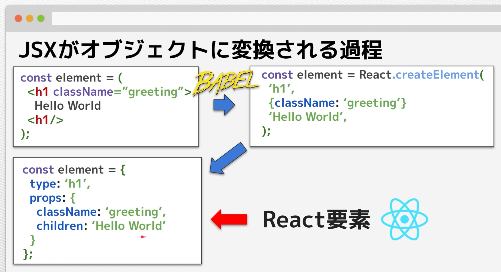
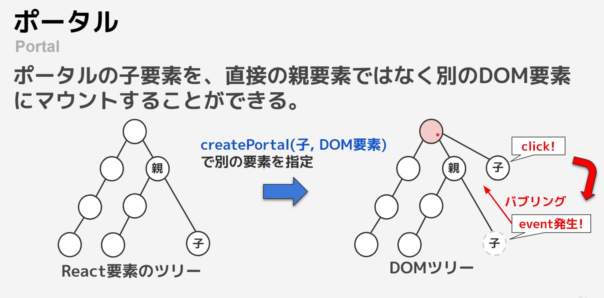
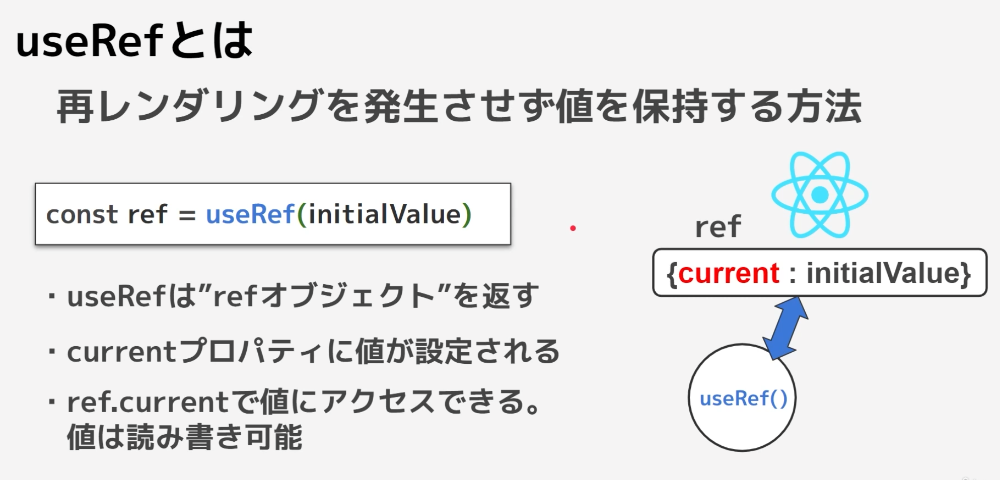
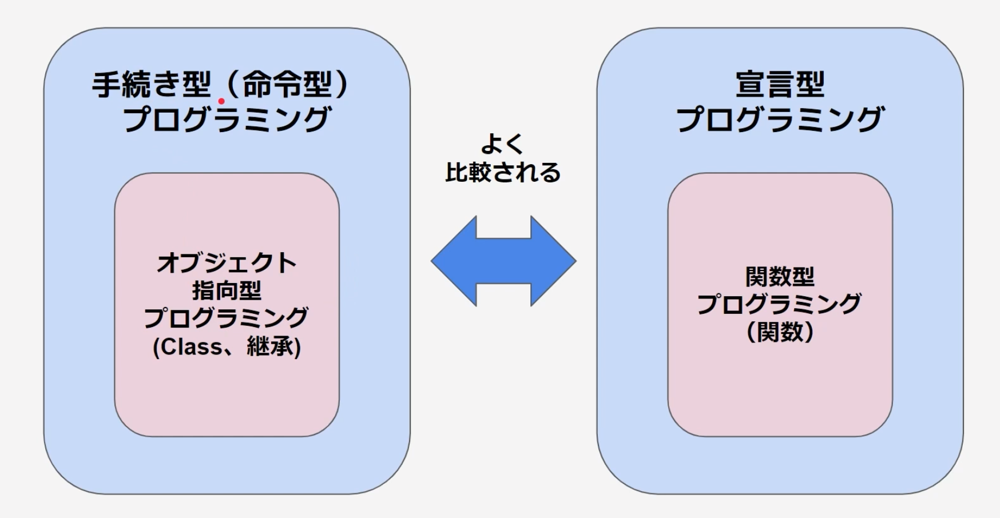
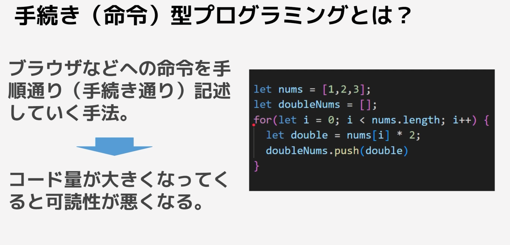
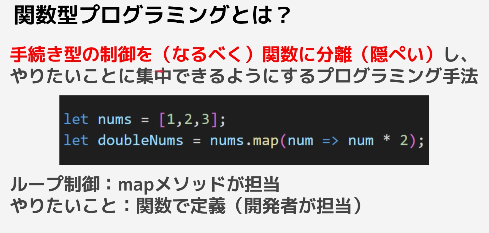

# 【2023最新版】React(v18)完全入門ガイド | Hooks,Nextjs,Redux,TypeScript

## セクション3 jsの記法について
./react-guide-material/03_js_basic

### アロー関数

### Import/Export
- export default はデフォルトでExportされる
  - Importする時は{}で囲う必要がない
  - export defaultしていないfunc等は{}で囲う必要がある

### コールバック関数

### 分割代入
- 配列を代入するときは順番が一致している必要がある
- オブジェクトを代入する時はプロパティ名(キー)が一致している必要がある
  - 逆にキーが一致していれば順番は関係ない

### スプレッド演算子
``` javascript
let arr = [1,2,3];
// =で代入
let newArr = arr;
// スプレッド演算子
let newArrSp = [...arr1];
```

- 配列を"="を使って代入をすると、代入元の配列と代入後の配列が同じものとして扱われる
  - だから代入後の配列に何か要素を追加したりすると、代入元の配列にも同じく要素が追加されてしまう
- スプレット演算子を利用すると代入元の配列を展開して全く新しい配列として定義することができる
  - 代入後の配列に何か要素を追加したりしても代入元の配列に変化が起こらないようになっている

### 三項演算子
変数 ? true : false;
ex)
``` javascript
const a = true;
let result = a ? "trueだよ" : "falseだよ";
```

### truthyな値、falsyな値
- falsy：真偽値に変換した際に"偽(false)"とみなされる値のこと。
- truthy：それ以外

```
/* POINT falsyな値の一覧
false
0 (数字)
0n (big int)
"" (空文字)
null
undefined
NaN (Not a Number)
*/
```

### Promise
- 非同期処理とは
  - 記載された順番通りに処理が行われないもの
    - setTimeoutとか
- Promiseとは
  - 非同期処理が終わった後に特定の処理を繋げることができる

``` javascript
let a = 0;

new Promise((resolve, reject) => {
    setTimeout(() => {
        a = 1;
        // resolveだとthen
        resolve(a)
        // rejectだとcatchが実行される
        // reject(a)
    }, 2000);
}).then((b) => {
    console.log(b);
    return b;
}).then((b) => {
    console.log(b);
}).catch((c) => {
    console.log('catchが実行', c)
})
```

### await/async
- await/async は Promiseを簡略化/使いやすくしたもの
  - resolveが呼ばれるまで処理がawaitで待機する

``` javascript
let a = 0;

init();
async function init() {
    try {
        const result = await new Promise((resolve, reject) => {
            setTimeout(() => {
                a = 1;
                reject(a)
            }, 2000);
        })
            console.log(result);
    } catch(e) {
        console.log('catchが実行', e)
    }
    
    // }).catch((c) => {
    //     console.log('catchが実行', c)
    // })
    
}
```


## セクション4 まずはReactに触れてみよう
### propsのルール
- propsは読み取り専用
- propsは親から子にしか渡すことができない

### jsxの正体
- jsxの定義
  - ReactによるJavaScriptの構文を拡張したもの
  - JSXはBABELによってJSのオブジェクトに変換される

```javascript
<h1>Hello!</h1>
↓
React.createElement("tag", "props", "textContent")
React.createElement("h1", null, "Hello!")
```



## セクション5 ステートとイベントリスナ
### イベントリスナとは
- 画面上でイベントが発生した時に実行したい関数を登録しておく場所

### 開発でよく使うイベントタイプ
#### 入力イベント
```javascript
<input
  type="text"
  // onChange 入力値の変更を検知
  onChange={() => console.log("onChange検知")}
  // onBlur 入力欄からのフォーカスが消えた時のイベントを検知
  onBlur={() => console.log("onBlur検知")}
  // onFocus フォーカスを検知
  onFocus={() => console.log("onFocus検知")}
/>
```

#### ホバーイベント
```javascript
<div
  className="hover-event"
  onMouseEnter={() => console.log("カーソルが入ってきました。")}
  onMouseLeave={() => console.log("カーソルが出ていきました。")}
>
```

### ステート
- state(状態)とは？
  - コンポーネント毎に保持・管理される値
  - ※コンポーネントないに定義された普通の変数はレンダリングのたびに初期化され、保持されない

### ステートとレンダリングの仕組み
- useStateを使う場合
  - onChange等で変更した値をuseStateで更新すると更新がある度にコンポーネントは再レンダリングされる
- useStateを使わない場合
  - onChange等で変更した値を普通の変数で定義しても再レンダリングはされない → JSX内でリアルタイムに値の変更を表示できない

### ステート使用時の注意点
- useStateはコンポーネント内のトップレベル(階層的な意味)に定義する必要がある
- 値の更新と再レンダリングは予約（非同期）される
- 前回のstate値を使用する場合は更新用関数に関数を渡す
- オブジェクト型のstateを更新する際は新しいオブジェクトを作成する
  - 全く同じオブジェクトだとエラーになる
- stateの値はコンポーネント毎に独立して管理される
- 一度消滅したコンポーネントのstateの値はリセットされる
- stateをpropsとして渡すことで子コンポーネントで利用できる
- コンポーネントの位置によってはstateが維持される

### オブジェクトのステート
- オブジェクト型のステートは新しい値をセットする時も同じ型のオブジェクトを渡す必要がある
  - スプレッド演算子を利用すれば、記述を減らすことができる

```javascript
const personObj = { name: "Tom", age: 18 };
const [person, setPerson] = useState(personObj);

const changeName = (e) => {
    // 全部記述する場合
    setPerson({ name: e.target.value, age: person.age })
    // スプレッド演算子を利用する場合
    setPerson({ ...person, name: e.target.value })
  }

```


## セクション6 制御構文とフォームの制御
### 配列をリスト表示
- map関数はJSX内に記述可能
  - mapは式だから
- for文はJSX内に記述不可能
  - forは文だから

### リストには必ずキーを設定しよう
- 前提として
  - ReactはReact要素ツリーの差分検出処理をしてDOMを更新している
- キーをつけなければいけない理由
  - キーなしの場合
    - 全要素を更新す流
  - キーありの場合
    - 要素の識別ができるようになり最小限の更新で抑えることができるようになる
- keyをつけるときの注意点
  - キーには必ず一位の値を設定する
  - キーに設定した値は変更しない
  - 配列のインデックスはなるべく使わない
    - インデックスは値が変わる可能性が高く、keyとvalueが一致しなくなる可能性があるから


## セクション7 ReactでDOM操作を行う方法
### createPortal
- ポータルとは
  - ポータルの小要素を、直接の親要素ではなく別のDOMようさにマウントすることができる



### useRef
- useRefでDOMを取得
  - refオブジェクトをref属性に渡すとDOMを参照することができる
- useRefは再レンダリングされない
  - 書き換え可能な情報としてコンポーネントに保持させておくことができる
- state は更新されるごとに再レンダーされるが、refオブジェクトの中身が変わっても再レンダーが走ることはない



### refを他のコンポーネントに渡す方法
- refはそのままだとpropsとして渡すことができない
  - 解決方法１
    - 受け取る側でrefという名前を使わない
  - 解決方法２
    - forwardRefを使う ←おすすめはこっち
``` javascript
const Input = forwardRef((props, ref) => {
  return <input type="text" ref={ref} />;
});
const Example = () => {
  const ref = useRef();
  return (
    <>
      <Input ref={ref} />
      <button onClick={() => ref.current.focus()}>
        インプット要素をフォーカスする
      </button>
    </>
  );
};
```

### useImperativeHandle
- refは便利だが、チーム開発等で意図しない使われ方をされるとバグが発生する
  - そこでrefの使い方に制限を儲けるのがuseImperativeHandle
``` javascript
const Input = forwardRef((props, ref) => {
  const inputRef = useRef();
  /* POINT useImperativeHandle
  第1引数: 親コンポーネントから受け取ったrefオブジェクト
  第2引数: 追加したいメソッドが格納されたオブジェクトを返す関数
   */
  useImperativeHandle(ref, () => ({
    myFocus() {
      inputRef.current.focus();
      console.log('フォーカス取得')
    }
  }))
  return <input type="text" ref={inputRef} />;
});
const Example = () => {
  const ref = useRef();
  return (
    <>
      <Input ref={ref} />
      <button onClick={() => ref.current.myFocus()}>
        インプット要素をフォーカスする
      </button>
    </>
  );
};
```

## セクション10 関数型プログラミング
### 関数型プログラミングとは？
#### よくある比較


#### 手続き(命令)型プログラミングとは？


#### 関数型プログラミングとは？


#### 関数型プログラミングのメリット（目標）
- コードの可読性の向上
- 拡張性・再利用性の向上
- テスト性の向上
- モジュール化の向上
- Tree Shakingの向上
  - TreeShaking：本番用のコードを作成するときに無駄なものを省く処理のこと

#### 関数型プログラミングの重要なキーワード
- 状態管理と処理を分離
  - 状態と処理は切り離す
- 純粋関数(副作用を排除する)
  - 特定の入力には特定の出力を返す
- 不変性
  - 一度設定した値は書き換えない


## セクション11 useReducerとuseContext
### useStateとuseReducerの違い
- useState:状態の更新の仕方は利用側に託す
- useReducer:状態の更新の仕方も状態側で担当する

### useContext
- useContextで定義した値はpropsを利用せずに複数コンポーネントからアクセスができる
- それぞれExport, Importする必要がある


